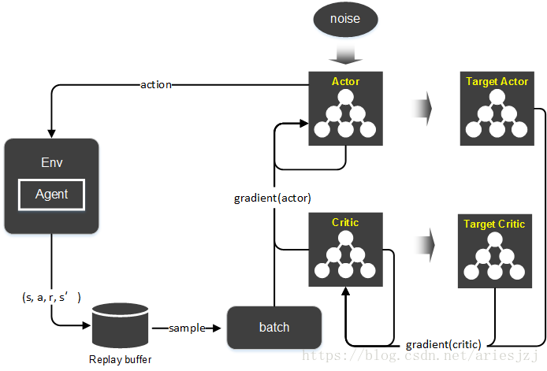
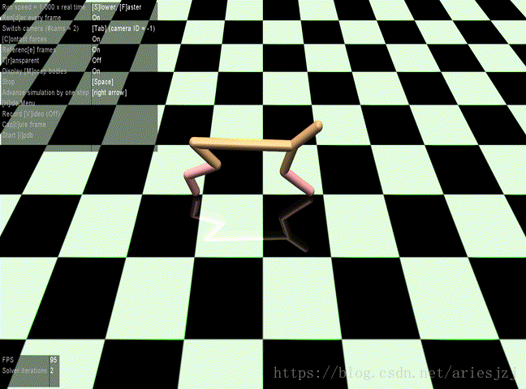
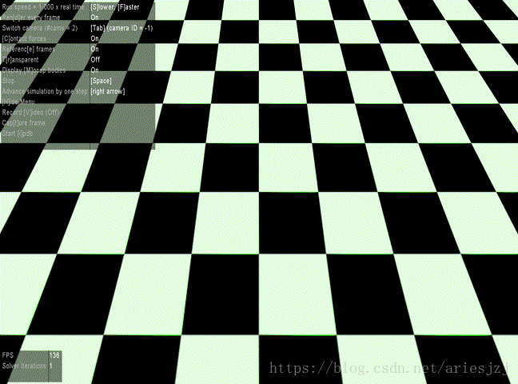

# OpenAI Baselines

## DDPG (Deep Deterministic Policy Gradient)

 ———————————————— 
版权声明：本文为CSDN博主「ariesjzj」的原创文章，遵循CC 4.0 by-sa版权协议，转载请附上原文出处链接及本声明。
原文链接：https://blog.csdn.net/jinzhuojun/article/details/82556127
 ———————————————— 

首先从文件main.py开始。这里主要解析参数。如果使用MPI的话确保只有第一个进程调用logger.configure()函数来初始化日志。这里基于mpi4py来使用MPI进行多进程加速。比如可以执行下面命令起两个进程来训练：

```
$ mpirun -np 2 python3 -m baselines.ddpg.main
```

紧接着进入到主要函数run()中。

```python

def run(env_id, seed, ...):
    env = gym.make(env_id)
    env = bench.Monitor(env, ...)
    # env.action_space.shape为(6,)
    nb_actions = env.action_space.shape[-1]
    
    # 往参数加入噪声来鼓励exploration。默认参数noise-type为adaptive-param_0.2，
    # 因此这里创建AdaptiveParamNoiseSpec()。
    param_noise = AdaptiveParamNoiseSpec()
    
    # 构建replay buffer。
    memory = Memory(limit=int(1e6)...)
    # 构建Actor和Critic网络。实现在models.py中。
    critic = Critic(layer_norm=layer_norm)
    actor = Actor(nb_actions, layer_norm=layer_norm)
    
    training.train(env=env, ...)

```

AdaptiveParamNoiseSpec的实现在noise.py文件中。noise.py中实现了三种添加噪声的方式，详细可参见论文《Parameter Space Noise for Exploration》。

- **AdaptiveParamNoiseSpec**: 详见论文P3中Adaptive noise scaling一节，先定义扰动和非扰动动作空间策略的距离，然后根据这个距离是否高于指定阀值（代码中的desired_action_stddev）来调节参数噪声的大小（代码中的current_stddev）。
- **NormalActionNoise**: 根据给定的均值和方差从正态分布中采样。
- **OrnSteinUhlenbeckActionNoise**: 使用Ornstein-Uhlenbeck process采样。这也是原版DDPG中用于动作探索时用的方法。
  
第一种为参数噪声方法，即通过在策略神经网络的参数中加入噪声，进而达到对该网络产生的动作加入噪声的效果；后两种为动作噪声方法，即直接对网络输出的动作加噪声。

初始化代码中的Memory就是replay buffer，实现在memory.py文件，它用以实现experience replay。Experience replay之前应用在DQN算法过，被证明可以有效减少样本时序上的关联，从而提高训练的稳定性。它的结构主要就是一系列的RingBuffer（大小默认为100W），分别存储当前和下一观察状态、动作、回报和是否终结信息。它的两个主要函数append()和sample()分别用于往这个buffer中添加数据，和从中进行采样（一个batch）。

训练的过程在training.py文件中，先来看其初始化过程：

```python

def train(env, ...):
    #　实现位于ddpg.py中。
    agent = DDPG(actor, critic, memory, ...)
        ...
        # 创建actor和critic的目标网络（target network）。.
        target_actor = copy(actor)
        self.target_actor = target_actor
        target_critic = copy(critic)
        self.target_critic = target_critic
        
        ...
        if self.param_noise is not None:
            # 参数加噪，详见《Parameter Space Noise for Exploration》。
            self.setup_param_noise(normalized_obs0)
        # 创建actor和critic网络优化器。
        self.setup_actor_optimizer()
        self.setup_critic_optimizer()
        if self.normalize_returns and self.enable_popart:
            # 目标归一化，详见《Learning values across many orders of magnitude》。
            self.setup_popart() 
        # 用于在线网络（或称主网络）向目标网络同步参数。
        self.setup_target_network_updates()

```

setup_param_noise()函数中主要处理参数加噪。首先它把actor网络拷贝一份到param_noise_actor。当打开参数加噪选项时，训练过程中要得到动作就是从该网络中获得。使用这个加噪处理过的actor网络得到扰动后动作的TF操作为perturbed_actor_tf。接下去，get_perturbed_actor_updates()函数对于perturbed_actor中的所有变量添加一个正态分布的噪声，其中的标准差参数来自于前面提到的param_noise_stddev，最后把这些更新操作返回放到perturb_policy_ops当中。此外，为了学习加噪时所用标准差，还需要将actor网络拷贝一份，称为adaptive_param_noise_actor，这个actor网络主要用于计算经加噪后输出的扰动动作与原动作的距离（用L2范数为测度），这个距离用来调节加噪时的标准差参数。

函数setup_actor_optimizer()和setup_critic_optimizer()分别用来创建actor和critic网络的优化器。这里主要分别实现论文中DDPG算法中actor的参数梯度(sampled policy gradient)：

$$
\left.\left.\nabla_{\theta^{\mu}} J \approx \frac{1}{N} \sum_{i} \nabla_{a} Q\left(s, a | \theta^{Q}\right)\right|_{s=s_{i}, a=\mu\left(s_{i}\right)} \nabla_{\theta^{\mu}} \mu\left(s | \theta^{\mu}\right)\right|_{s_{i}}
$$

和critic的参数梯度：

$$ 
\left.\nabla_{\theta^{q}} L=\nabla_{\theta^{Q}}\left[\frac{1}{N} \sum_{i} y_{i}-Q\left(s_{i}, a_{i} | \theta^{Q}\right)\right)^{2}\right]
$$

其中 $ y_i=r_i+\gamma Q^\prime(s_{i+1},\mu^\prime(s_{i+1}|\theta^{\mu^\prime})|\theta^{Q^\prime}) $ 。以actor网络优化器为例，通过flatgrad()函数先求actor_loss对actor网络中可学习参数的梯度，然后进行clip再flatten，返回存于actor_grads。actor_optimizer是类型为MpiAdam的优化器，创建时传入Adam所需参数。这个MpiAdam与传统Adam优化器相比主要区别是分布式的。因为训练在多个进程中同时进行，因此在其参数更新函数update()中，它先会用Allreduce()函数将所有局部梯度汇成全局梯度，然后按Adam的规则更新参数。

setup_target_network_update()函数构建在线网络更新目标网络的操作。DeepMind在论文《Human-level control through deep reinforcement learning》中引入了目标网络提高训练的稳定性。目标网络和在线网络结构是一样的，只是每过指定步后，在线网络的参数会以 $ \theta_{target}=(1−\tau)\theta_{target}+\tau\theta_{online} $ 的形式拷贝给目标网络。

再看训练主循环(位于training.py文件)：


```python
def train(env, ...):
    ...
    agent.initialize(sess)
    agent.reset()
    obs = env.reset()
    ...
    for epoch in range(nb_epochs): # 500
        for cycle in range(nb_epoch_cycles): # 20
            # 一、 采集训练样本
            for t_rollout in range(nb_rollout_steps): # 100
                # pi()函数位于ddpg.py，主要就是执行一把actor网络，得到动作与Q值。
                action, q = agent.pi(obs, apply_noise=True, compute_Q=True)
                    action, q = self.sess.run([actor_tf, self.critic_with_actor_tf], ...)
                ...
                # 首先将actor网络输出的动作按env中动作空间进行scale，
                # 然后在env中按此动作执行一步，并获得观察、回报等信息。
                new_obs, r, done, info = env.step(max_action * action)
                ...
                # 将每一步的信息记录到replay buffer中。
                epoch_actions.append(action)
                epoch_qs.append(q)
                agent.store_transition(obs, action, r, new_obs, done)
                    memory.append(obs0, action, reward, obs1, terminal1)
                obs = new_obs
                
                if done:
                    # episode结束，重置环境。
                    ...
                    agent.reset()
                    obs = env.reset()
                    
            # 二、 训练
            for t_train in range(nb_train_steps): # 50
                # batch_size = 64
                if memory.nb_entries >= batch_size and t_train % param_noise_adaption_interval == 0:
                    distance = agent.adapt_param_noise()
                    ...
                # 返回critic和actor网络的loss。然后将它们分别存入epoch_critic_losses和epoch_actor_losses。
                cl, al = agent.train()
                ...
                agent.update_traget_net()
	                self.sess.run(self.target_soft_updates)
                
            # 三、 评估
            for t_rollout in range(nb_eval_steps):
                eval_action, eval_q = agent.pi(...)
                eval_obs, eval_r, eval_done, eval_info = eval_env.step(max_action * eval_action)

```

上面流程中，先调用agent的initialize()函数进行初始化。

```python
def initialize(self, sess):
    self.sess = sess
    self.sess.run(tf.global_variables_initializer())
    self.actor_optimizer.sync()
    self.critic_optimizer.sync()
    self.sess.run(self.target_init_updates)

```

除了TF中常规初始化操作外，接下来调用actor和critic优化器的sync()函数。由于这里的优化器使用的是MpiAdam，sync()函数中会将网络中参数进行flatten然后广播给其它进程，其它进程会把这些参数unflatten到自己进程中的网络中。最后执行target_init_updates操作将在线网络中的参数拷贝到目标网络中。

接下来的reset()函数主要是了添加动作噪声。这里假设使用的是参数加噪，执行perturb_policy_ops为actor网络参数添加噪声。

然后开始训练。这个训练过程有几层循环。最外层为epoch，循环nb_epochs次。每次epoch最后会作一些统计。第二层循环为cycle，循环nb_epoch_cycles次。这个循环的每次迭代中，主要分三步：

- 一、执行rollout指定步数（nb_rollout_steps）。这部分的主要作用是采集训练样本。

  1. 调用agent.pi()根据当前的观察状态s得到agent的动作a aa。这里实际是做了actor网络（这个网络的参数是加噪的）的inference得到动作a，然后根据观察状态和动作通过critic网络得到Q(s,a)的估计。
  2. 如果是当前为MPI的rank 0进程且渲染选项打开，则调用env.render()画出当前状态。
  3. 调用env.step让agent在Gym运行环境中执行上面步骤1中选取的动作a aa，并返回下一观察状态，回报和episode是否结束等信息。
  4. 把这次状态转移中的各项信息(s,s′,a,r,done)通过agent.store_transition()存到replay buffer中。留作之后训练使用。
  5. 如果Gym中执行后发现episode结束，则将episode相关信息记录后调用agent.reset()和env.reset()。它们分别对actor网络进行参数加噪，和Gym运行环境的重置。
- 二、训练更新参数。训练nb_train_steps轮。每一轮中：

  1. 当已有sample能够填满一个batch，且执行param_noise_adaption_interval步训练，调用agent.adapt_param_noise()函数。这个函数主要用来自适应参数加噪时用的标准差。前面提到在setup_param_noise()函数中创建了adaptive_actor_tf，这时候就会对它进行参数加噪，然后基于sample batch中的观察状态得到其动作，再与原始actor网络输出动作求距离。求出距离后，调用param_noise（即AdaptiveParamNoiseSpec）的adapt()函数调整参数加噪的标准差。
  2. 执行agent.train()学习网络参数。

```python 

# 先从replay buffer中取batch_size大小的样本。
batch = self.memory.sample(batch_size=self.batch_size)
# 根据选项判断是否要用Pop-Art算法对critic网络输出（即Q函数值）进行normalization。
# 这里因为默认都为false，所以先忽略。
if self.normalize_returns and self.enable_popart:
    ...
else
    # 先以观察状态obs1为输入通过目标critic网络得到Q函数估计值，
    # 然后考虑回报通过差分更新公式得到目标Q函数值。
    target_Q = self.sess.run(self.target_Q, feed_dict={
        self.obs1: batch['obs1'],
        self.rewards: batch['rewards'],
        self.terminals1: batch['terminals1'].astype('float32'),
    })
# Get all gradients and perform a synced update.
ops = [self.actor_grads, self.actor_loss, self.critic_grads, self.critic_loss]
# 计算actor和critic网络的参数梯度以及loss计算。
actor_grads, actor_loss, critic_grads, critic_loss = self.sess.run(ops, feed_dict={
    self.obs0: batch['obs0'],
    self.actions: batch['actions'],
    self.critic_target: target_Q,
})
# 执行参数的更新。如果是通过MPI多进程训练，这里调用Allreduce将各个进程
# 中actor和critic的梯度先收集起来求平均，然后使用Adam优化方式更新参数。
self.actor_optimizer.update(actor_grads, stepsize=self.actor_lr)
self.critic_optimizer.update(critic_grads, stepsize=self.critic_lr)
return critic_loss, actor_loss

```

  3. 记录actor和critic网络的loss，最后调用agent.update_target_net()函数进行DDPG算法中在线网络到目标网络的参数更新：

$$ \theta^{Q^\prime}=\tau\theta^Q+(1-\tau)\theta^{Q^\prime} $$

$$ \theta^{\mu^\prime}=\tau\theta^\mu+(1-\tau)\theta^{\mu^\prime} $$

- 三、评估当前模型。大体过程是在Gym环境中执行nb_eval_steps步，每一步动作通过actor网络得到（这时不用参数加噪声，因为不是训练），最后统计相关信息，如episode中reward的累积，与Q函数值等。

整个算法大体的流转如下图：




另外，可以看到，在上述实现中，还整合了其它几篇论文中的idea：

《Learning values across many orders of magnitude》

在Atari中，回报会被clip到特定范围。这种做法有利于让多个游戏使用同一算法，但是对回报进行clipping会产生不同的行为。自适用归一化（adaptive normalization）能移除这种领域相关的启发，且不降低效果。对于输入和输出层的归一化已经研究得比较多了，但对目标的归一化研究得并不多。文中对目标 $ Y_t $ 进行仿射变换：$ \hat{Y}_t=\sum_t^{-1}{(Y_t-\mu_t)} $ 。如果记g为未归一化函数，而f为归一化函数，对于输入x的未归一化近似可写成 $ f(x)=\sum{g(x)}+\mu $ 和归一化目标 $ \hat{Y}_t $ 来定义。但是，这里似乎又引入了scale $ \Sigma $和shift $\mu$两个超参数，比较麻烦。于是，文中提出可以根据单独的目标函数来更新这两个参数。也就是说，将归一化参数的学习从函数的学习分离出来，这样就需要同时达到两个性质：

- **(ART)** 更新scale $\Sigma$ 和 shift $\mu$ 使得 $\Sigma^{-1}(Y - \mu)$ 是正规化的。
- **(POP)** 当改变scale和shift时保持unnormalized function的输出一致。
  
Pop-Art算法全称"Preserving Outputs Precisely, while Adaptivey Rescaling Targets"。

《Parameter Space Noise for Exploration》

我们知道，reinforcement learning中一个非常重要的问题就是探索问题。一种直观上的做法就是在策略中加扰动。这可以分两类：1) 在策略网络的输出动作上直接加噪声。2) 往策略网络的参数中加噪声。在上面项目中noise.py文件中实现的三种加噪方法中，normal和OrnsteinUhlenbeck方法（来自论文《On the theory of the brownian motion》）属于第一种，adaptive-param属于第二种。这篇文章的中心之一就是往参数加噪的做法能产生更有效的探索。

为了实现参数空间噪声，可以将高斯噪声添加到参数空间 $ \tilde{\theta} = \theta + \mathcal{N}(0, \sigma^2 I) $。参数空间噪声需要我们挑选合适的scale $\sigma$，而这个因子一方面高度依赖特定网络结构，另一方面又是随时间变化的。Adaptive scaling的思想就是每过K步更新这个scale参数 $ \sigma_k$，即如果扰动策略与非扰动策略的距离小于阈值，则让该参数变大，否则变小（见论文公式8）。

另外，论文还提到evolutionary strategies（ES）方法也采用了parameter perturbation的思想，但这篇论文提出ES忽略了时域信息，因而需要更多的样本。

《Layer normalization》

深度学习训练中一个很大的问题是一层中的梯度和上一层的输出强相关，这会带来covariate shift问题。流行的batch normalization方法主要用于克服该问题，从而可以减少训练时间。它对每个隐藏单元的输入作归一化。理论上这个归一化是相对于整个训练集的，但实际中往往不现实，因此是拿mini-batch来近似。遗憾的是，它有些限制：

- 不适用于RNN。用于RNN时需要对每一步都保存单独的统计。但如果测试集中出现比训练集中任意样本都长的序列就玩不转了。
- 对mini batch的大小有要求，如不能用于batch为1的情况（总共就一个归一化也没意义）。


而Layer normalization的做法是在同一层中做归一化，从而让同层神经元输入拥有相同的均值和方差。从而也避免了上面的问题。

如果要将训练的结果可视化，可以将render-eval和evaluation两个选项设为True。在训练的一开始，策略还未学习，基本无法前进，而且过一会就扑街了。



遗憾的是，到了第180步左右，算法学习到了一种很2B的前进方法。。。



而且之后似乎在这条路上越走越远。当到第300步左右时，就变这样了。。。


要想稳定学习到理想的策略，还是有段路要走。


