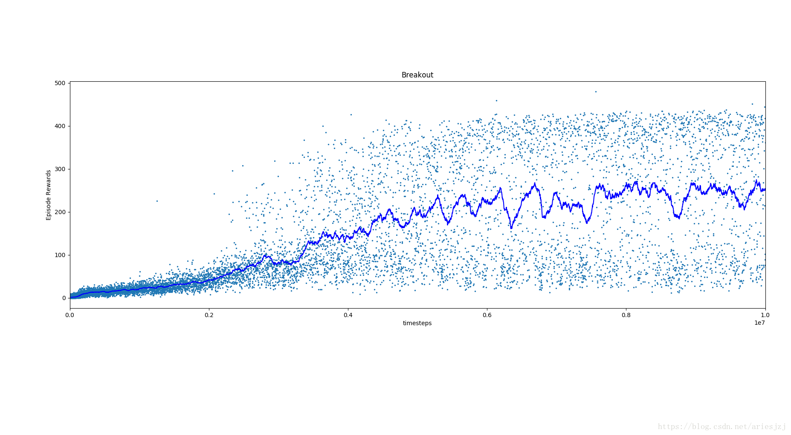

# OpenAI Baselines PPO (Proximal Policy Optimization)

 ———————————————— 
版权声明：本文为CSDN博主「ariesjzj」的原创文章，遵循CC 4.0 by-sa版权协议，转载请附上原文出处链接及本声明。
原文链接：https://blog.csdn.net/jinzhuojun/article/details/80417179
 ———————————————— 


OpenAI出品的baselines项目提供了一系列deep reinforcement learning（DRL，深度强化学习或深度增强学习）算法的实现。现在已经有包括DQN,DDPG,TRPO,A2C,ACER,PPO在内的近十种经典算法实现，同时它也在不断扩充中。它为对DRL算法的复现验证和修改实验提供了很大的便利。本文主要走读其中的PPO（Proximal Policy Optimization）算法的源码实现。PPO是2017年由OpenAI提出的一种DRL算法，它不仅有很好的performance（尤其是对于连续控制问题），同时相较于之前的TRPO方法更加易于实现。之前写过一篇杂文《深度增强学习（DRL）漫谈 - 信赖域（Trust Region）系方法》对其历史、原理及相关方法做了简单介绍，因此本文主要focus在代码实现的学习了解上。

OpenAI baselines项目中对于PPO算法有两个实现，分别位于ppo1和ppo2目录下。其中ppo2是利用GPU加速的，官方号称会快三倍左右，所以下面主要是看ppo2。对应论文为《Proximal Policy Optimization Algorithms》，以下简称PPO论文。本文我们就以atari这个经典的DRL实验场景为例看一下大体流程。启动训练的命令在readme中有：

```
$ python3 -m baselines.ppo2.run_atari
```

这样就开始训练了，每轮参数更新后会打印出相关信息。如：

```
------------------------------------
| approxkl           | 0.003101161 |
| clipfrac           | 0.17260742  |
| eplenmean          | 941         |
| eprewmean          | 34.9        |
| explained_variance | 0.704       |
| fps                | 981         |
| nupdates           | 1653        |
| policy_entropy     | 0.85041255  |
| policy_loss        | -0.01297911 |
| serial_timesteps   | 211584      |
| time_elapsed       | 1.63e+03    |
| total_timesteps    | 1692672     |
| value_loss         | 0.036234017 |
------------------------------------
```
可以看到，入口为run_atari.py中的main()：

```python
def main():
# 实现位于common/cmd_util.py。它主要为parser添加几个参数：
#   1) env:代表要执行atari中的哪个游戏环境。默认为BreakoutNoFrameskip-v4，即“打砖块”。
#   2) seed：随机种子。默认为０。
#   3) num-timesteps：训练的频数。默认为10M(10e6)次。
     parser = atari_arg_parser()
# 通过参数选择policy network的形式，实现在policies.py。默认为CNN。这里有三种选择：
#   1) CNN：相应函数为CnnPolicy()。发表于《Nature》上的经典DRL奠基论文《Human-level control through
#       deep reinforcement learning》中使用的神经网络结构：conv->relu->conv->relu->conv->relu->
#       fc->relu。注意它是双头网络，一头输出policy，一头输出value。
#   2) LSTM：相应函数为LstmPolicy()。它将CNN的输出之上再加上LSTM层，这样就结合了时间域的信息。
#   3) LnLSTM：相应函数为LnLstmPolicy()。其它的和上面一样，只是在构造LSTM层时添加了Layer normalization
#       （详见论文《Layer Normalization》）
     parser.add_argument('--policy', help='Policy architecture', choices=['cnn', 'lstm', 'lnlstm'], default='cnn')
# 用刚才的构建的parser解析命令行传入的参数。
     args = parser.parse_args()
# 这个项目中实现了简单的日志系统。其中日志所在目录和格式可以用过OPENAI_LOGDIR和OPENAI_LOG_FORMAT两个环境
# 变量控制。实现类Logger中主要有两个字典：name2val和name2cnt。它们分别是名称到值和计数的映射。
     logger.configure()
# 这里是开始正式训练了。
     train(args.env, num_timesteps=args.num_timesteps, seed=args.seed,
         policy=args.policy)
```

主函数中最后调用了train()函数进行训练。

```python
 def train(env_id, num_timesteps, seed, policy):
     # 首先是一坨和TensorFlow相关的环境设置，比如根据cpu核数设定并行线程数等。
     ...
     # 构建运行环境。流程还比较长，下面会再详细地理下。
     env = VecFrameStack(make_atari_env(env_id, 8, seed), 4)
     # 对应前面说的三种策略网络。用于根据参数选取相应的实现函数。
     policy = {'cnn' : CnnPolicy, 'lstm' : LstmPolicy, 'lnlstm' : LnLstmPolicy}[policy]
     # 使用PPO算法进行学习。其中传入的参数不少是模型的超参数。详细可参见PPO论文中的Table 5。
     ppo2.learn(policy=policy, env=env, nsteps=128, nminibatches=4,
         lam=0.95, gamma=0.99, noptepochs=4, log_interval=1,
         ent_coef=.01,
         lr=lambda f : f * 2.5e-4,
         cliprange=lambda f : f * 0.1,
         total_timesteps=int(num_timesteps * 1.1))
```

可以看到，train()函数中比较重要的就是两大块：环境构建和模型参数学习。首先看看环境构建流程：

```python
# make_atari_env()函数实现位于common/cmd_util.py。看函数名就知道主要就是创建atari环境。通过OpenAI gym
# 创建基本的atari环境后，还需要层层封装。gym中提供了Wrapper接口，让开发者通过decorator设计模式来改变环境中的设# 定。
def make_atari_env(env_id, num_env, ...):  # 这里的num_env为8，意味着会创建8个独立的并行运行环境。
    def make_env(rank):
        def _thunk():
            # 创建由gym构建的atari环境的封装类。
            env = make_atari(env_id):       
                # 通过OpenAI的gym接口创建gym环境。
                env = gym.make(env_id)  
                # NoopResetEnv为gym.Wrapper的继承类。每次环境重置（调用reset()）时执行指定步随机动作。
                env = NoopResetEnv(env) 
                # MaxAndSkipEnd也是gym.Wrapper的继承类。每隔4帧返回一次。返回中的reward为这４帧reward
                # 之和，observation为最近两帧中最大值。
                env = MaxAndSkipEnd(env)    
                return env
            # 每个环境选取不同的随机种子，避免不同环境跑得都一样。
            env.seed(seed + rank)       
            # 实现在monitor.py中。Monitor为gym中Wrapper的继承类，对环境Env进行封装，主要添加了对
            # episode结束时信息的记录。
            env = Monitor(env, ...)     
            return wrap_deepmind(env, ...):
                # 标准情况下，对于atari中的很多游戏（比如这儿的打砖块），命掉光了（如该游戏有5条命）算episode
                # 结束，环境重置。这个Wrapper的作用是只要掉命就让step()返回done，但保持环境重置的时机不变
                #（仍然是命掉完时）。原注释中说这个trick在DeepMind的DQN中用来帮助value的估计。
                env = EpisodeicLifeEnv(env)     
                # 通过OpenCV将原始输入转成灰度图，且转成84 x 84的分辨率。
                env = WarpFrame(env)        
                # 将reward按正负值转为+1, -1和0。
                env = ClipRewardEnv(env)    
                ...
                return env
        return _thunk   
    ...
    # 返回SubprocVecEnv对象。
    return SubprocVecEnv([make_env(i + start_index) for i in range(num_env)])　
```

创建num_env个元素（这里为８）的数组，每一个元素为一个函数闭包_thunk()。VecEnv实现在baselines/common/vec_env/\__init__.py，它是一个抽象类，代表异步向量化环境。其中包括几个重要的抽象函数： 
reset()用于重置所有环境，step_async()用于通知所有环境开始根据给定动作执行一步，step_wait()得到执行完的结果。step_wait()等待step_async()的结果。step()就是step_async() 加上step_wait()。而VecEnvWrapper也为VecEnv的继承类，和gym中提供的Wrapper功能类似，如果要对VecEnv实现的默认行为做修改的话就可以利用它。

上面函数最后返回的SubprocVecEnv类为VecEnv的继承类，它主要将上面创建好的函数放到各个子进程中去执行。在SubprocVecEnv实现类中，构造时传入在子进程中执行的函数。通过Process创建子进程，并通过Pipe进行进程间通信。make_atari_env()中创建SubprocVecEnv后，又立马被VecFrameStack封装了一把。VecFrameStack为VecEnvWrapper的实现类，实现在vec_frame_stack.py。在VecFrameStack的构造函数中，wos为gym环境中的原始状态空间，维度为[84,84,1]。low和high分别为这些维度的最低和最高值。stackedobs就是把几个环境的状态空间叠加起来，即维度变为(8, 84, 84, 4)。8为环境个数，(84,84)为单帧状态维度，也就是游戏的屏幕输出，4代表最近4帧（因为会用最近4的帧的游戏画面来作为网络模型的输入）。

可以看到，除了正常的封装外，还需要做一些比较tricky，比较靠经验的处理。理论上我们希望这部分越少越好，因为越少算法就越通用。然而现状是这一块tuning对结果的好坏可能产生比较大的影响。。。

好了，接下去就可以看看PPO算法主体了。入口为ppo2.py的learn()函数。

```python
# 首先一坨参数设定，仍然以run_atari.py为例。
nenvs = env.num_envs                # 8 
ob_space = env.observation_space    # Box(84,84,4)
ac_space = env.action_space         # Discrete(4)
nbatch = nenvs * nsteps             # 1024 = 8 * 128。共８个并行环境，每个环境执行128步。即nbatch为单个batch中所有环境中执行的总步数。
nbatch_train = nbatch // nminibatches   # 256 = 1024 / 4。nbatch_train为训练时batch的大小。即1024步分４次训练。

# make_model()函数是一个用于构造Model对象的函数。
make_model = lambda : Model(policy=policy, ob_space=ob_space, ...)  
# 创建Model。
model = make_model()
```

模型的构建也是最核心的部分。这块要和PPO论文配合起来看，否则容易晕。

```python
class Model(object):
    def __init__(self, *, policy, ob_space, ac_space, nbatch_act, nbatch_train,
                 nsteps, ent_coef, vf_coef, max_grad_norm):
        # 用前面指定的网络类型构造两个策略网络。act_model用于执行策略网络根据当前observation返回
        # action和value等，即只做inference。train_model顾名思义主要用于参数的更新（模型的学习）。
        # 注意这两个网络的参数是共享的，因此train_model更新的参数可以体现在act_model上。假设使用默
        # 认的CnnPolicy，其中的step()函数计算action, value function和action提供的信息量；
        # value()函数计算value。

        # nbatch_act = 8，就等于环境个数nenvs。因为每一次都分别对８个环境执行，得到每个环境中actor的动作。
        # 1为nsteps。其实在CNN中没啥用，在LSTM才会用到（因为LSTM会考虑前nsteps步作为输入）。
        act_model = policy(sess, ob_space, ac_space, nbatch_act, 1, reuse=False)    
            h = nature_cnn(X)       # 如前面所说，《Nature》上的网络结构打底。然后输出policy和value。
            pi = fc(h, 'pi', ...)   # for policy
            vf = fc(h, 'v')         # for value function
            # 根据action space创建相应的参数化分布。如这里action space是Discrete(4)，那分布
            # 就是CategoricalPdType()。然后根据该分布类型，结合网络输出（pi），得到动作概率分
            # 布CategoricalPd，最后在该分布上采样，得到动作a0。neglogp0即为该动作的自信息量。
            pdtype = make_pdtype() 
            pd = self.pdtype.pdfromflat(pi) 
            a0 = self.pd.sample()
            neglogp0 = self.pd.neglogp(a0)
        # 和构建action model类似，构建用于训练的网络train_model。nbatch_train为256，因为是用于模型的学习,
        # 因此和act_model不同，这儿网络输入的batch size为256。
        train_model = policy(sess, ob_space, ac_space, nbatch_train, nsteps, reuse=True)    
        # 创建一坨placeholder，这些是后面要传入的。
        A = train_model.pdtype.sample_placeholder([None])  # action
        ADV = tf.placeholder(tf.float32, [None])           # advantage
        R = tf.placeholder(tf.float32, [None])             # return
        OLDNEGLOGPAC = tf.placeholder(tf.float32, [None])  # old -log(action)
        OLDVPRED = tf.placeholder(tf.float32, [None])      # old value prediction
        LR = tf.placeholder(tf.float32, [])                # learning rate
        CLIPRANGE = tf.placeholder(tf.float32, [])         # clip range，就是论文中的epsilon。

        neglogpac = train_model.pd.neglogp(A)              # -log(action)
        entropy = tf.reduce_mean(train_model.pd.entropy())

        # 训练模型提供的value预测。
        vpred = train_model.vf  
        # 和vpred类似，只是与上次的vpred相比变动被clip在由CLIPRANGE指定的区间中。
        vpredclipped = OLDVPRED + tf.clip_by_value(train_model.vf - OLDVPRED, - CLIPRANGE, CLIPRANGE)    
        vf_losses1 = tf.square(vpred - R)
        vf_losses2 = tf.square(vpredclipped - R)
        # V loss为两部分取大值：第一部分是网络预测value值和R的差平方；第二部分是被clip过的预测value值
        # 和return的差平方。这部分和论文中似乎不太一样。主要目的应该是惩罚value值的过大更新。
        vf_loss = .5 * tf.reduce_mean(tf.maximum(vf_losses1, vf_losses2))
        # 论文中的probability ratio。把这里的exp和log展开就是论文中的形式。
        ratio = tf.exp(OLDNEGLOGPAC - neglogpac)    
        pg_losses = -ADV * ratio
        pg_losses2 = -ADV * tf.clip_by_value(ratio, 1.0 - CLIPRANGE, 1.0 + CLIPRANGE)
        # 论文公式(7)，由于前面都有负号，这里是取maximum.
        pg_loss = tf.reduce_mean(tf.maximum(pg_losses, pg_losses2)) 
        approxkl = .5 * tf.reduce_mean(tf.square(neglogpac - OLDNEGLOGPAC))
        clipfrac = tf.reduce_mean(tf.to_float(tf.greater(tf.abs(ratio - 1.0), CLIPRANGE)))
        # 论文公式(9)，ent_coef, vf_coef分别为PPO论文中的c1, c2，这里分别设为0.01和0.5。entropy为文中的S；pg_loss为文中的L^{CLIP}
        loss = pg_loss - entropy * ent_coef + vf_loss * vf_coef　    

        # 构建trainer，用于参数优化。
        grads = tf.gradients(loss, params)
        trainer = tf.train.AdamOptimizer(learning_rate=LR, max_grad_norm)
        _train = trainer.apply_gradients()
```

上面模型构造完了，接下来就是模型学习过程的skeleton了。Runner类主要作为学习过程的组织协调者。

```python
# Runnder是整个训练过程的协调者。
runner = Runner(env=env, model=model, nsteps=nsteps,...)
# total_timesteps = 11000000, nbatch = 1024，因此模型参数更新nupdates = 10742次。
nupdates = total_timesteps // nbatch
for update in range(1, nupdates+1) # 对应论文中Algorithm的外循环。
    obs, returns, masks, actions, values, ... = runner.run()
        # 模型（上面的act_model）执行nsteps步。有8个环境，即共1024步。该循环对应论文中Algorithm的第2,3行。
        for _ in range(self.nsteps): 
            # 执行模型，通过策略网络返回动作。
            actions, values, self.states, ... = self.model.step(self.obs, self.status, ...)
            # 通过之前创建的环境执行动作，得到observation和reward等信息。
            self.obs[:], rewards, self.dones, infos = self.env.step(actions)
        # 上面环境执行返回的observation, action, values等信息都加入mb_xxx中存起来，后面要拿来学习参数用。
        mb_obs = np.asarray(mb_obs, dtype=self.obs.dtype) 
        mb_rewards = np.asarray(mb_rewards, dtype=np.float32) 
        mb_actions = np.asarray(mb_actions) 
        ...
        # 估计Advantage。对应化文中Algorithm的第4行。
        for t in reversed(range(self.nsteps)):
            # 论文中公式(12)。
            delta = mb_rewards[t] + self.gamma * nextvalues * nextnonterminal - mb_values[t]  
            # 论文中公式(11)。
            mb_advs[t] = lastgaelam = delta + self.gamma * self.lam * nextnonterminal * lastgaelam 
        mb_returns = mb_advs + mb_values # Return = Advantage + Value
        return (*map(sf01, (mb_obs, mb_returns, mb_dones, mb_actions, mb_values, mb_neglogpacs)), mb_states, epinfos)
    epinfobuf.extend(epinfos) # Gym中返回的info。
    # 论文中Algorithm 1第6行。
    if states is None: # nonrecurrent version
        inds = np.arange(nbatch)   
        for _ in range(noptepochs): # epoch为4
            np.random.shuffle(inds)
            # ８个actor，每个运行128步，因此单个batch为1024步。1024步又分为4个minibatch，
            # 因此单次训练的batch size为256(nbatch_train)。
            for start in range(0, nbatch, nbatch_train): # [0, 256, 512, 768]
                end = start + nbatch_train
                mbinds = inds[start:end]
                slices = (arr[mbinds] for arr in (obs, ...))
                # 将前面得到的batch训练数据作为参数，调用模型的train()函数进行参数学习。
                mblossvals.append(model.train(lrnow, cliprangenow, *slices)) 
                    # Advantage = Return - Value
                    advs = returns - values 
                    # Normalization
                    advs = (advs - advs.mean()) / (advs.std() + 1e-8) 
                    # cliprange是随着更新的步数递减的。因为一般来说训练越到后面越收敛，每一步的差异也会越来越小。 
                    # neglogpacs和values都是nbatch_train维向量，即shape为(256, )。
                    td_map = {train_mode.X:obs, A:actions, ADV:advs, R:returns, LR:lr, 
                        CLIPRANGE:cliprange, OLDNEGLOGPAC:neglogpacs, OLDVPRED:values}
                    return sess.run([pg_loss, vf_loss, entropy, approxkl, clipfrac, _train], td_map)
    else:
        ...
    # 每过指定间隔打印以下参数。
    if update % log_interval == 0 or update == 1:
        ev = explained_variance(values, returns)
        logger.logkv("serial_timesteps", update*nsteps)
        logger.logkv("nupdates", update)
        ...
    # 满足条件时保存模型。
    if save_interval and (update % save_interval == 0 or update == 1) and logger.get_dir():
        ...
        model.save(savepath)
env.close()
```

训练结束，我们可以通过下面命令将训练过程中的主要指标-Episode Rewards图形化。可以用–dirs参数指定前面训练时log所在目录。

```
$ python3 -m baselines.results_plotter
```
可以看到，如期望地，随着训练的进行，学习到的策略使得agent能在一轮游戏中玩得越来越久，一轮中的累积回报也就越来越大。 



最后，是骡子是马还是要出来溜溜才知道。下面脚本用于将训练产生的ckpt load起来，然后运行atari环境，执行策略网络产生的动作，并将过程渲染出来。参数为ckpt文件路径。

```python
import gym
from gym import spaces
import multiprocessing
import joblib
import sys
import os
import numpy as np
import tensorflow as tf

from baselines.ppo2 import ppo2
from baselines.common.cmd_util import make_atari_env, atari_arg_parser
from baselines.common.atari_wrappers import make_atari, wrap_deepmind
from baselines.ppo2.policies import CnnPolicy
from baselines.common.vec_env.vec_frame_stack import VecFrameStack

def main(argv):
    ncpu = multiprocessing.cpu_count()
    config = tf.ConfigProto(allow_soft_placement=True,
                            intra_op_parallelism_threads=ncpu,
                            inter_op_parallelism_threads=ncpu)
    config.gpu_options.allow_growth = True
    sess = tf.Session(config=config)

    env_id = "BreakoutNoFrameskip-v4"
    seed = 0
    nenvs = 1
    nstack = 4

    env = wrap_deepmind(make_atari(env_id))
    ob_space = env.observation_space
    ac_space = env.action_space

    wos = env.observation_space
    low = np.repeat(wos.low, nstack, axis=-1)
    high = np.repeat(wos.high, nstack, axis=-1)
    stackedobs = np.zeros((nenvs,)+low.shape, low.dtype)
    observation_space = spaces.Box(low=low, high=high, dtype=env.observation_space.dtype)
    vec_ob_space = observation_space

    act_model = CnnPolicy(sess, vec_ob_space, ac_space, nenvs, 1, reuse=False)

    with tf.variable_scope('model'):
        params = tf.trainable_variables()

    #load_path = '/tmp/openai-2018-05-27-15-06-16-102537/checkpoints/00030'
    load_path = argv[0]
    loaded_params = joblib.load(load_path)
    restores = []
    for p, loaded_p in zip(params, loaded_params):
        restores.append(p.assign(loaded_p))
    sess.run(restores)
    print("model " + load_path + " loaded")

    obs = env.reset()
    done = False
    for _ in range(1000):
        env.render()
        obs = np.expand_dims(obs, axis=0)

        stackedobs = np.roll(stackedobs, shift=-1, axis=-1)
        stackedobs[..., -obs.shape[-1]:] = obs

        actions, values, states, neglogpacs = act_model.step(stackedobs)
        print("%d, action=%d" % (_, actions[0]))
        obs, reward, done, info = env.step(actions[0])
        if done:
            print("done")
            obs = env.reset()
            stackedobs.fill(0)

    sess.close()

if __name__ == '__main__':
    if (len(sys.argv)) != 2:
        sys.exit("Usage: %s ckpt_path" % sys.argv[0])
    if not os.path.exists(sys.argv[1]):
        sys.exit("ckpt file %s not found" % sys.argv[1])
    main(sys.argv[1:])
```

可以看到当更新迭代500次时，算法已经能学习到一些游戏的基本策略了，但仍不是很娴熟。５条命基本在1000步内就会被干光。 


 
当更新迭代5000次后，学到的策略比500次时已经成熟很多了，5条命在1000步内基本够用。 
 


当更新迭代10000次后，基本已经玩得很溜了。试验中1000步只损了一条命。 


