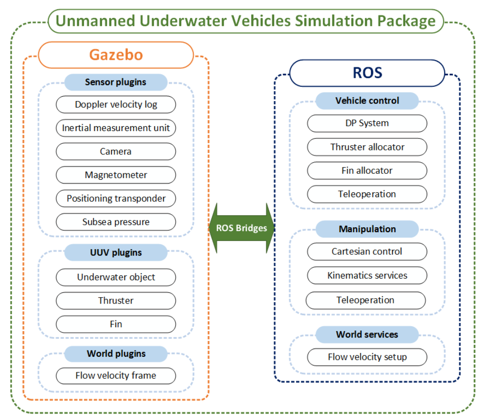

# How to setup the MoveIt for a new robot

http://docs.ros.org/kinetic/api/moveit_tutorials/html/doc/setup_assistant/setup_assistant_tutorial.html

- Virtual Joints:
Virtual joints are used primarily to attach the robot to the world. For the Panda we will define only one virtual joint attaching the **panda_link0** of the Panda to the **world frame**. This virtual joint represents the motion of the base of the robot in a plane.
- Planning Groups
Planning groups are used for semantically describing different parts of your robot, such as defining what an arm is, or an end effector.

- Label End Effectors
We have already added the gripper of the Panda. Now, we will designate this group as a special group: end effectors. Designating this group as end effectors allows some special operations to happen on them internally.

- 3D Perception

## MoveIt Tutorials

The RobotModel and RobotState classes are the core classes that give you access to a robot's kinematics.
- RobotModel
The RobotModel class contains the relationships between all links and joints including their joint limit properties as loaded from the URDF. The RobotModel also separates the robot's links and joints into planning groups defined in the SRDF. A separate tutorial on the URDF and SRDF can be found here: URDF and SRDF Tutorial.

- RobotState
The RobotState contains information about the robot at a snapshot in time, storing vectors of joint positions and optionally velocites and accelerations that can be used to obtain kinematic information about the robot that depends on it's current state such as the Jacobian of an end effector.
RobotState also contains helper functions for setting the arm location based on the end effector location (Cartesian pose) and for computing Cartesian trajectories.

[Custom Manipulator Simulation in Gazebo and Motion Planning with MoveIt!](https://medium.com/@tahsincankose/custom-manipulator-simulation-in-gazebo-and-motion-planning-with-moveit-c017eef1ea90)

## Underwater Simulators
[UUV Simulator: A Gazebo-based Package for Underwater Intervention and Multi-Robot Simulation](https://ieeexplore.ieee.org/document/7761080)

- **UWSim**: It offers a wide range of sensor models, provides realistic renderings of underwater environments due its graphics engine [OpenSceneGraph](http://www.openscenegraph.org/) and has been used in several academic publications. The physics engine is used only for handling contact forces and the implementation of the vehicle dynamics, including the simulation of thruster forces, is located in one monolithic ROS node, but it could be modified to adhere to a more modular structure or interfaced with an external platform such as Matlab, if necessary. Setting up a new simulation, **however**, requires the configuration of the scenario, vehicles, and other objects in a single XML description file, which can make this task laborious.

- [**freefloating-gazebo**](https://github.com/freefloating-gazebo): In order to exploit existing physics engines in a more efficient way, _freefloating-gazebo_ was predented as an example of a bridge between Gazebo and UWSim for the simulation of underwater vehicles. Gazebo is a general-purpose open-source robotics simulation platform mainteained and developed by the Open-Source Robotics Foundation (OSRF). It provides interfaces to four different physic engines for the simulation of rigid-body dynamics and a graphical user interface to visualize the scenario. The _freefloating-gazebo_ package includes plugins for Gazebo to allow the generation of hydrodynamic and hydrostatic forces and apply these to the underwater vehicle links while transmitting the pose of simulated objects to UWSim via ROS to exploit the underwater effects of the graphics engine. This application, **however**, does not include the computation of added-mass forces because of stability concerns. It also allows the modular construction of a scnario on the Gazebo implementation (also in run-time), **but** it still requires the monolithic XML description for the complete simulation so that the UWSim visualization can be initialized .

- **Rock-Gazebo**: A similar implementation involves the extension of Gazebo to the Robot Construction Kit ([ROCK](https://www.rock-robotics.org/documentation/index.html)), known as _Rock-Gazebo_. In this case, the ROCK visualization tool was entended with OpenSceneGraph for rendering the underwater environment while the physics simulation is run in Gazebo. At this moment, it does not yet support the simulation of multople underwater vehicles.

UUV Simulator - Software structure

Underwater manipulators
Underwater manipulators can currently only be operated using ROS modules. They are available as units that can be added to the vehicle's body frame using pre-defined macros. This is done to allow the generation of several configurations for the same vehicle by only adding an extra unit to the robot description.
The manipulators are initialized with ROS controllers for each joint and can be operated by using a joystick to command the reference velocity for the end-effector. A Jocabian-transpose Cartesian controller allows control of the end-effector's pose. Each manipulator and its respective ROS nodes (e.g. controllers, kinematics solvers services) are initialized within a unique ROS namespace, allowing multiple manipulator units (on one or multiple vehicles) to be initialized simultaneously.

## [UUV Simulator](https://uuvsimulator.github.io/)

The UUV Simulator is a package containing the implementation of Gazebo plugins and ROS nodes necessary for the simulation of unmanned underwater vehicles, such as ROVs (remotely operated vehicles) and AUVs (autonomous underwater vehicles).

**Purpose of the project**
This software is a research prototype, originally developed for the EU ECSEL Project 661207 [SWARMS](http://swarms.eu/).

